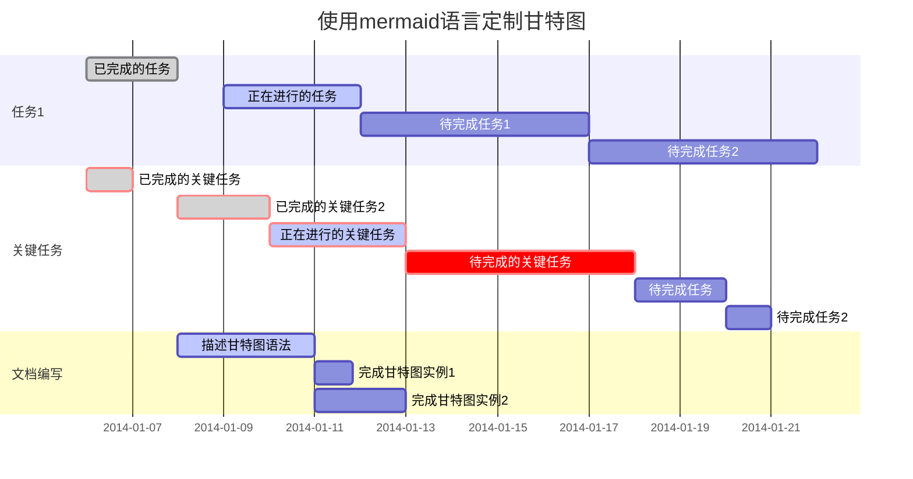

# 高性能软件的开发计划
## 现有问题
1. 当撤单发起的时候，OrderSysID还未成功生成，也就是说真正在上交所的订单还未生成，撤单会返回未找到撤单的错误
2. 现有的报单系统过于繁杂，

近期任务安排:
- [x] 整理Markdown手册
- [ ] 改善项目
   - [x] 优化首页显示方式
   - [x] 修复闪退问题
   - [x] 修复视频卡顿
- [ ] A3项目修复
   - [x] 修复数值错误

